# E Commerce Sales Analytics Dashboard

## Project Overview

This project is an end to end E Commerce Sales Analytics project based on the Sample Superstore dataset.

The project uses Excel, MySQL, Python, Power BI, HTML, CSS and JavaScript to analyse sales, profit, customers, products, regions, discounts and shipping performance.

The main purpose of this project is to convert raw sales data into useful business insights and present the results through reports and interactive dashboards.

## Live Dashboard

Live dashboard:

https://prakash-v181.github.io/E-Commerce-Sales-Analytics/

The web dashboard includes:

- Total Sales
- Total Profit
- Total Orders
- Total Customers
- Profit Margin
- Monthly Sales and Profit
- Sales by Category
- Sales by Region
- Customer Segment Analysis
- Ship Mode Analysis
- Top Products
- Top Customers
- Top States
- Region Filter
- Category Filter
- Product Search

## Project KPI Summary

| KPI | Value |
|---|---:|
| Total Sales | $2,297,200.86 |
| Total Profit | $286,397.02 |
| Overall Profit Margin | 12.47% |
| Total Orders | 5,009 |
| Total Customers | 793 |
| Total Products | 1,850 |
| Average Order Value | $458.61 |
| Loss Making Records | 1,871 |

Loss Making Records means transaction records where the Profit value is negative.

## Project Workflow

The project follows this workflow:

```text
Superstore Dataset
        |
Data Cleaning and Preparation
        |
Excel Analysis
        |
MySQL and SQL Analysis
        |
Python Data Analysis
        |
Business Insights
        |
Power BI Dashboard
        |
Web Dashboard
        |
Business Recommendations
```

## Tools and Technologies

### Data Analysis

- Microsoft Excel
- MySQL
- Python
- Pandas
- Matplotlib
- Jupyter Notebook
- OpenPyXL

### Business Intelligence

- Microsoft Power BI

### Web Development

- HTML
- CSS
- JavaScript
- Chart.js

### Development Tools

- Visual Studio Code
- Git
- GitHub
- GitHub Pages

## Project Structure

```text
E-Commerce-Sales-Analytics/
|
|-- Dataset/
|   |-- Sample - Superstore.csv
|
|-- Excel/
|   |-- Cleaned_Data.xlsx
|
|-- SQL/
|   |-- Database.sql
|   |-- Queries.sql
|
|-- Python/
|   |-- analysis.ipynb
|   |
|   |-- charts/
|       |-- profit_by_region.png
|       |-- sales_by_category.png
|       |-- top10_customers.png
|       |-- top10_products.png
|       |-- output.png
|       |-- output1.png
|       |-- output2.png
|       |-- output3.png
|       |-- output4.png
|       |-- output5.png
|       |-- output6.png
|       |-- output7.png
|       |-- output8.png
|       |-- output9.png
|       |-- output10.png
|       |-- output11.png
|
|-- PowerBI/
|   |-- Ecommerce.pbix
|
|-- Dashboard Images/
|   |-- dashboard.png
|
|-- index.html
|-- LICENSE
|-- README.md
|-- requirements.txt
|-- .gitignore
```

## Business Questions

This project answers the following business questions:

1. What are the total sales and total profit?
2. What is the overall profit margin?
3. Which category has the highest sales?
4. Which category has the highest profit?
5. Which sub categories are profitable?
6. Which sub categories are making losses?
7. Which products are making the highest losses?
8. Which region performs best?
9. Which region has the lowest profit margin?
10. Which customer segment is most profitable?
11. Which customers have the highest sales?
12. Which customers have the highest profit?
13. What is the relationship between discount and profit?
14. Which shipping mode takes the longest time?
15. Which months have the highest sales?
16. Which quarter performs best?
17. How have sales changed over the years?
18. How has profit changed over the years?
19. Which products repeatedly make losses?
20. What actions can improve business profitability?

## Yearly Performance

| Year | Sales | Profit | Profit Margin |
|---|---:|---:|---:|
| 2014 | $484,247.50 | $49,543.97 | 10.23% |
| 2015 | $470,532.51 | $61,618.60 | 13.10% |
| 2016 | $609,205.60 | $81,795.17 | 13.43% |
| 2017 | $733,215.26 | $93,439.27 | 12.74% |

### Findings

- 2017 had the highest sales.
- 2017 had the highest profit.
- 2016 had the highest profit margin.
- Sales and profit increased strongly during the analysed period.

## Monthly Sales Analysis

| Month | Sales |
|---:|---:|
| 1 | $94,924.84 |
| 2 | $59,751.25 |
| 3 | $205,005.49 |
| 4 | $137,762.13 |
| 5 | $155,028.81 |
| 6 | $152,718.68 |
| 7 | $147,238.10 |
| 8 | $159,044.06 |
| 9 | $307,649.95 |
| 10 | $200,322.98 |
| 11 | $352,461.07 |
| 12 | $325,293.50 |

### Findings

- November had the highest monthly sales.
- December had the second highest monthly sales.
- February had the lowest monthly sales.
- Sales were strong during the last part of the year.

## Quarterly Performance

| Quarter | Sales | Profit | Profit Margin |
|---|---:|---:|---:|
| Q1 | $359,681.58 | $48,023.74 | 13.35% |
| Q2 | $445,509.62 | $55,284.54 | 12.41% |
| Q3 | $613,932.11 | $72,467.08 | 11.80% |
| Q4 | $878,077.56 | $110,621.66 | 12.60% |

### Findings

- Q4 had the highest sales.
- Q4 had the highest profit.
- Q1 had the highest quarterly profit margin.
- Q4 is an important period for inventory and marketing planning.

## Regional Performance

| Region | Sales | Profit | Profit Margin |
|---|---:|---:|---:|
| West | $725,457.82 | $108,418.45 | 14.94% |
| East | $678,781.24 | $91,522.78 | 13.48% |
| Central | $501,239.89 | $39,706.36 | 7.92% |
| South | $391,721.91 | $46,749.43 | 11.93% |

### Findings

- West is the strongest region.
- West has the highest sales.
- West has the highest profit.
- West has the highest profit margin.
- Central has the lowest profit margin.
- Central should be checked for pricing, discount, product mix and cost issues.

## Customer Segment Analysis

| Segment | Sales | Profit | Profit Margin |
|---|---:|---:|---:|
| Consumer | $1,161,401 | $134,119 | 11.55% |
| Corporate | $706,146 | $91,979 | 13.03% |
| Home Office | $429,653 | $60,299 | 14.03% |

### Findings

- Consumer has the highest sales.
- Consumer has the highest total profit.
- Home Office has the highest profit margin.
- Home Office has good potential for profitable growth.

## Category Performance

| Category | Sales | Profit | Profit Margin |
|---|---:|---:|---:|
| Technology | $836,154.03 | $145,454.95 | 17.40% |
| Furniture | $741,999.80 | $18,451.27 | 2.49% |
| Office Supplies | $719,047.03 | $122,490.80 | 17.04% |

### Findings

- Technology has the highest sales.
- Technology has the highest profit.
- Technology has a strong profit margin.
- Furniture has good sales but very low profit margin.
- Furniture needs a detailed profitability review.

## Sub Category Performance

### Highest Profit Margin Sub Categories

| Sub Category | Sales | Profit | Profit Margin |
|---|---:|---:|---:|
| Labels | $12,486.31 | $5,546.25 | 44.42% |
| Paper | $78,479.21 | $34,053.57 | 43.39% |
| Envelopes | $16,476.40 | $6,964.18 | 42.27% |
| Copiers | $149,528.03 | $55,617.82 | 37.20% |
| Fasteners | $3,024.28 | $949.52 | 31.40% |

### Lowest Profit Margin Sub Categories

| Sub Category | Sales | Profit | Profit Margin |
|---|---:|---:|---:|
| Tables | $206,965.53 | -$17,725.48 | -8.56% |
| Bookcases | $114,880.00 | -$3,472.56 | -3.02% |
| Supplies | $46,673.54 | -$1,189.10 | -2.55% |
| Machines | $189,238.63 | $3,384.76 | 1.79% |
| Chairs | $328,449.10 | $26,590.17 | 8.10% |

### Finding

Tables are one of the major profitability problems. They generated about $207,000 in sales but made a loss of about $17,725.

## Loss Analysis

### Loss Making Records

Number of loss making records: 1,871

Total loss: -$156,131.29

### Total Loss by Category

| Category | Total Loss |
|---|---:|
| Furniture | -$60,936.11 |
| Office Supplies | -$56,615.26 |
| Technology | -$38,579.92 |

### Finding

Furniture has the highest total loss among the three categories.

## Major Loss Making Sub Categories

The analysis identified the following major loss making sub categories:

- Binders
- Tables
- Machines
- Bookcases
- Chairs
- Appliances
- Phones
- Furnishings
- Storage
- Supplies

## Top Loss Making Products

The analysis identified the following products with significant losses:

- Cubify CubeX 3D Printer Double Head Print
- GBC DocuBind P400 Electric Binding System
- Lexmark MX611dhe Monochrome Laser Printer
- GBC Ibimaster 500 Manual ProClick Binding System
- GBC DocuBind TL300 Electric Binding System
- Cubify CubeX 3D Printer Triple Head Print
- Fellowes PB500 Electric Punch Plastic Comb Binding Machine with Manual Bind
- Chromcraft Bull Nose Wood Oval Conference Tables and Bases
- Ibico EPK 21 Electric Binding System
- Bush Advantage Collection Racetrack Conference Table

These products should be checked for pricing, discount, cost and demand.

## Customer Profitability

### Highest Sales Customer

Sean Miller

Sales: $25,043.05

Profit: -$1,980.74

Sean Miller is an important case because the customer has high sales but negative profit.

### Highest Profit Customer

Tamara Chand

Sales: $19,052.22

Profit: $8,981.32

Profit Margin: 47.14%

### Finding

High sales do not always mean high profit.

Customer performance should be reviewed using:

- Sales
- Profit
- Profit Margin
- Discount
- Product Mix

## Shipping Analysis

### Average Shipping Days by Ship Mode

| Ship Mode | Average Shipping Days |
|---|---:|
| Same Day | 0.04 |
| First Class | 2.18 |
| Second Class | 3.24 |
| Standard Class | 5.01 |

### Findings

- Same Day has the shortest shipping time.
- Standard Class has the longest shipping time.
- Shipping mode can be used to evaluate delivery performance.

## Discount Analysis

### Average Profit by Discount Level

| Discount | Average Profit |
|---:|---:|
| 0.00 | $66.90 |
| 0.10 | $96.06 |
| 0.15 | $27.29 |
| 0.20 | $24.70 |
| 0.30 | -$45.68 |
| 0.32 | -$88.56 |
| 0.40 | -$111.93 |
| 0.45 | -$226.65 |
| 0.50 | -$310.70 |
| 0.60 | -$43.08 |
| 0.70 | -$95.87 |
| 0.80 | -$101.80 |

### Average Profit by Discount Group

| Discount Group | Average Profit |
|---|---:|
| 0% | $66.90 |
| 1 to 20% | $26.50 |
| 21 to 40% | -$77.86 |
| 41 to 60% | -$134.62 |
| 61 to 80% | -$98.35 |

### Discount and Profit Correlation

Correlation: -0.2195

The analysis shows a negative relationship between discount and profit. Higher discount levels are generally associated with lower profit.

Correlation does not prove that discount is the only reason for lower profit.

## Dashboard Preview


## Python Visualisations

Python was used for exploratory data analysis and visualisation.

### Core Business Charts

#### Profit by Region


#### Sales by Category


#### Top 10 Customers by Sales


#### Top 10 Products by Sales


### Additional Python Charts

#### 1. Average Shipping Days by Ship Mode

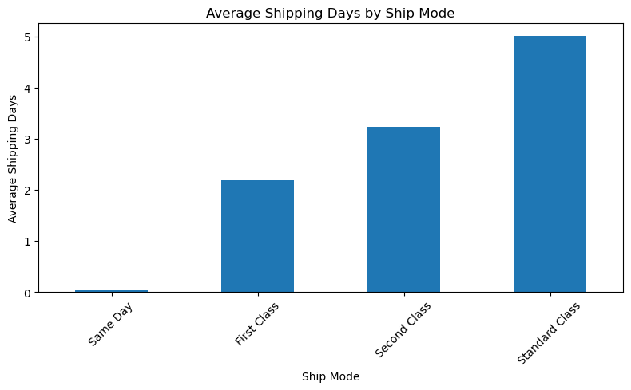

#### 2. Average Profit by Discount Level

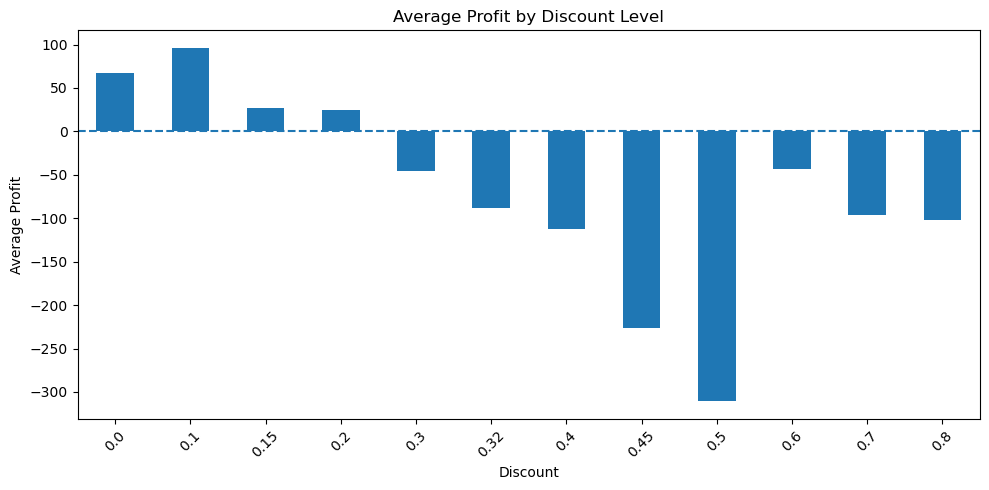

#### 3. Average Profit by Discount Group

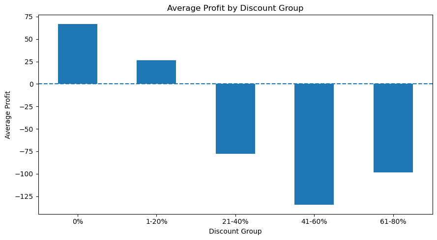

#### 4. Total Loss by Category

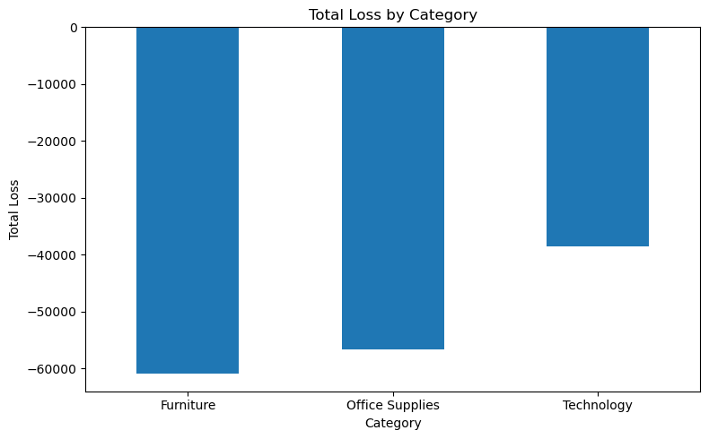

#### 5. Top 10 Loss Making Sub Categories

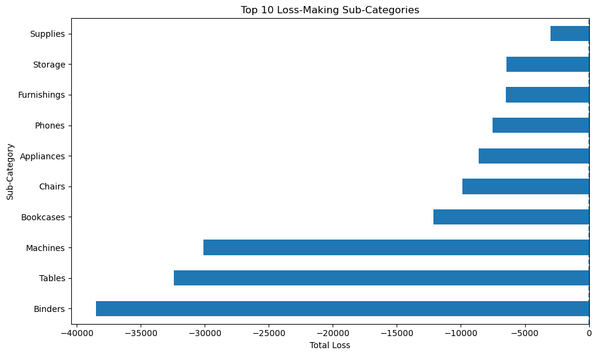

#### 6. Top 10 Loss Making Products

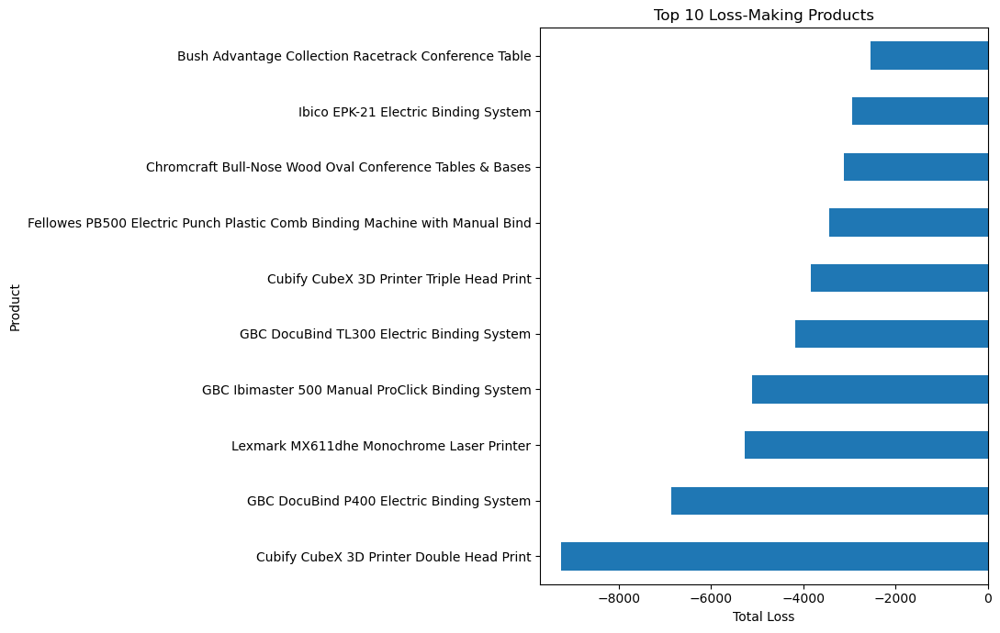

#### 7. Profit Margin of Repeatedly Loss Making Products

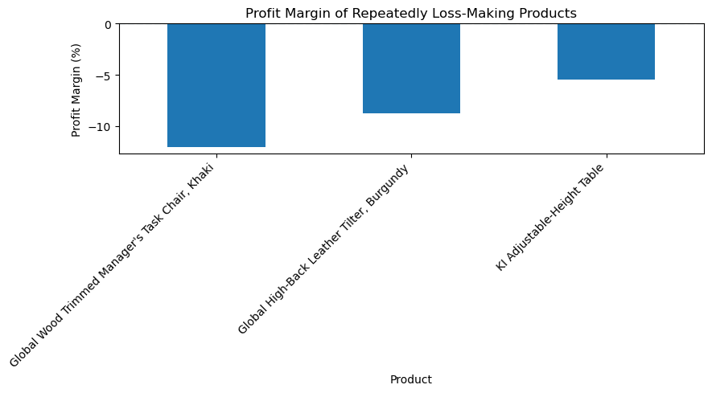

#### 8. Yearly Sales Trend

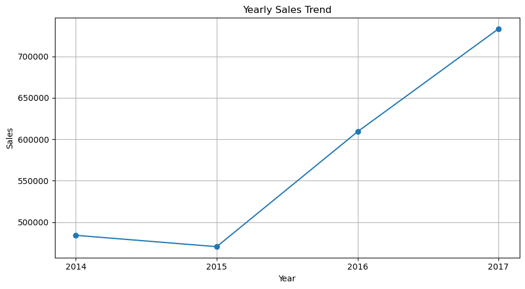

#### 9. Yearly Profit Trend

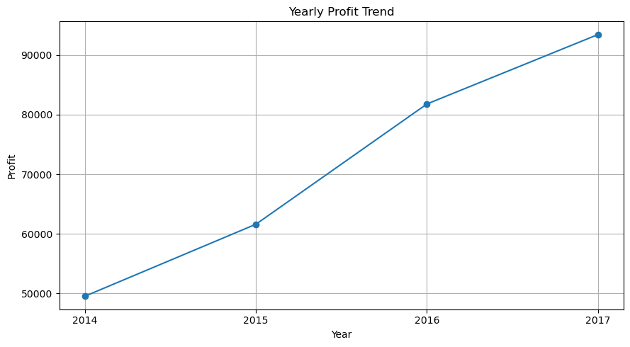

#### 10. Yearly Profit Margin Trend

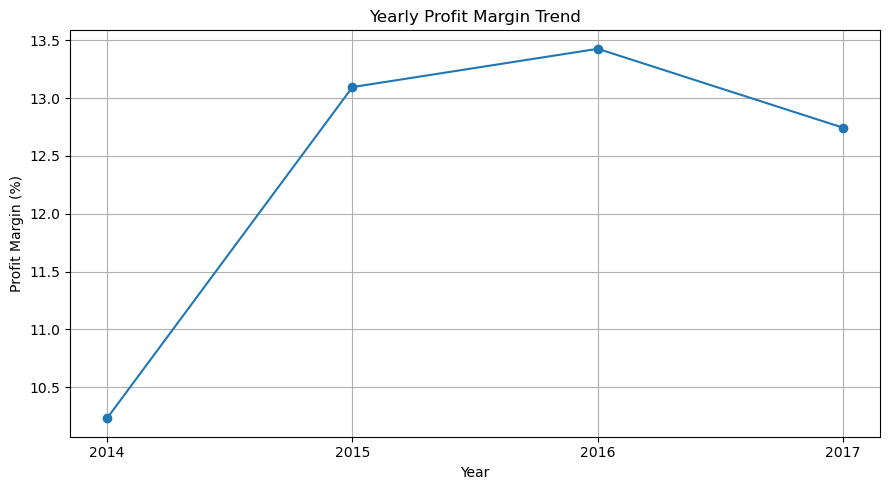

#### 11. Monthly Sales Trend

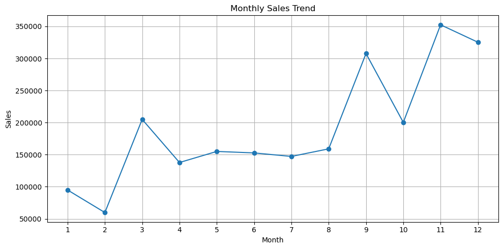

#### 12. Discount vs Profit

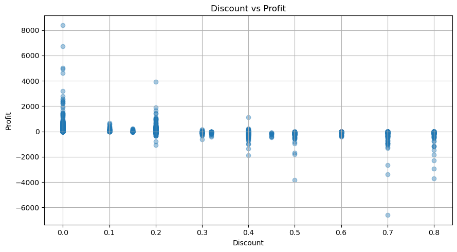

## Power BI Dashboard

The Power BI dashboard provides interactive analysis of sales, profit, customers, products, categories, segments and regions.

### Power BI KPIs

- Total Sales
- Total Profit
- Total Orders
- Total Customers
- Profit Margin

### Power BI Visualisations

- Sales by Category
- Profit by Region
- Monthly Sales Trend
- Sales by Segment
- Top 10 Products
- Top 10 Customers
- Regional Performance
- Product Performance

Power BI file:

```text
PowerBI/Ecommerce.pbix
```

Open the file using Microsoft Power BI Desktop.

## Web Dashboard

The web dashboard was developed using:

- HTML
- CSS
- JavaScript
- Chart.js

The dashboard includes:

- KPI cards
- Sales charts
- Profit charts
- Filters
- Product search
- Category analysis
- Regional analysis
- Customer analysis
- Sales trends
- Profit trends

Live dashboard:

https://prakash-v181.github.io/E-Commerce-Sales-Analytics/

## MySQL Analysis

MySQL was used for database creation and SQL analysis.

SQL files:

```text
SQL/Database.sql
SQL/Queries.sql
```

The SQL analysis includes:

- Total sales
- Total profit
- Orders
- Customers
- Products
- Category performance
- Sub category performance
- Regional performance
- Customer performance
- Discount analysis
- Profitability analysis
- Business queries

## Excel Analysis

Excel was used for:

- Data cleaning
- Data validation
- Formula based analysis
- Sorting
- Filtering
- Data preparation
- Initial data exploration

Cleaned data file:

```text
Excel/Cleaned_Data.xlsx
```

## Business Recommendations

### 1. Focus on Technology Growth

Technology has the highest sales and profit.

Recommendation:

Continue growing Technology while maintaining its current profit margin.

### 2. Review Furniture Profitability

Furniture has a 2.49% profit margin.

Recommendation:

Review product costs, pricing, discounts and product mix.

### 3. Investigate Tables and Bookcases

Tables have a profit margin of -8.56%.

Bookcases have a profit margin of -3.02%.

Recommendation:

Check pricing, discounts, product costs and individual product performance.

### 4. Review Central Region

Central has the lowest regional profit margin at 7.92%.

Recommendation:

Compare Central with West and identify differences in pricing, discounts, product mix and sales practices.

### 5. Review High Sales but Loss Making Customers

Sean Miller has high sales but negative profit.

Recommendation:

Review customer level discounts, product mix and order profitability.

### 6. Grow Home Office

Home Office has the highest segment profit margin at 14.03%.

Recommendation:

Increase Home Office sales while maintaining its current profitability.

### 7. Control High Discounts

Higher discount groups have negative average profit.

Recommendation:

Review discounts above 20%, especially for products with already low profit margins.

### 8. Prepare for Q4

Q4 has the highest sales and profit.

Recommendation:

Plan inventory, marketing and promotional activities before the Q4 period.

## Key Project Insights

- Technology is the strongest category.
- West is the strongest region.
- Central has the lowest regional profit margin.
- Home Office has the highest segment profit margin.
- Furniture has high sales but weak profitability.
- Tables are a major loss making sub category.
- Several products repeatedly make losses.
- Higher discounts are associated with lower average profit.
- 2017 had the highest annual sales and profit.
- 2016 had the highest annual profit margin.
- Q4 had the highest quarterly sales and profit.
- November had the highest monthly sales.
- High sales do not always mean high profit.

## Python Libraries

```text
pandas
matplotlib
openpyxl
jupyter
```

## Installation

### Step 1: Clone the Repository

```bash
git clone https://github.com/prakash-v181/E-Commerce-Sales-Analytics.git
```

### Step 2: Open the Project Folder

```bash
cd E-Commerce-Sales-Analytics
```

### Step 3: Install Python Libraries

```bash
pip install -r requirements.txt
```

### Step 4: Start Jupyter Notebook

```bash
jupyter notebook
```

### Step 5: Open the Python Analysis

```text
Python/analysis.ipynb
```

## Power BI Setup

Open:

```text
PowerBI/Ecommerce.pbix
```

Use Microsoft Power BI Desktop to open the file.

Refresh the dataset if required.

## Dataset

Dataset name: Sample Superstore

Rows: 9,994

Columns: 21

The dataset contains information about:

- Orders
- Customers
- Products
- Categories
- Sub Categories
- Regions
- Sales
- Quantity
- Discount
- Profit
- Shipping

## Dashboard Preview


## Skills Demonstrated

This project demonstrates practical skills in:

- Data Cleaning
- Data Preparation
- Exploratory Data Analysis
- Excel
- MySQL
- SQL
- Python
- Pandas
- Matplotlib
- Power BI
- Data Visualisation
- KPI Analysis
- Business Intelligence
- Profitability Analysis
- Customer Analysis
- Product Analysis
- Regional Analysis
- Segment Analysis
- Discount Analysis
- Dashboard Development
- HTML
- CSS
- JavaScript
- Chart.js
- Git
- GitHub
- GitHub Pages

## Project Highlights

This project combines data analysis, business intelligence and web development into one complete portfolio project.

### Data Layer

```text
CSV Dataset
Excel
MySQL
```

### Analysis Layer

```text
Python
Pandas
Matplotlib
Jupyter Notebook
```

### Business Intelligence Layer

```text
Power BI
```

### Presentation Layer

```text
HTML
CSS
JavaScript
Chart.js
GitHub Pages
```

## Author

Prakash

GitHub:

https://github.com/prakash-v181

Project Repository:

https://github.com/prakash-v181/E-Commerce-Sales-Analytics

Live Dashboard:

https://prakash-v181.github.io/E-Commerce-Sales-Analytics/
