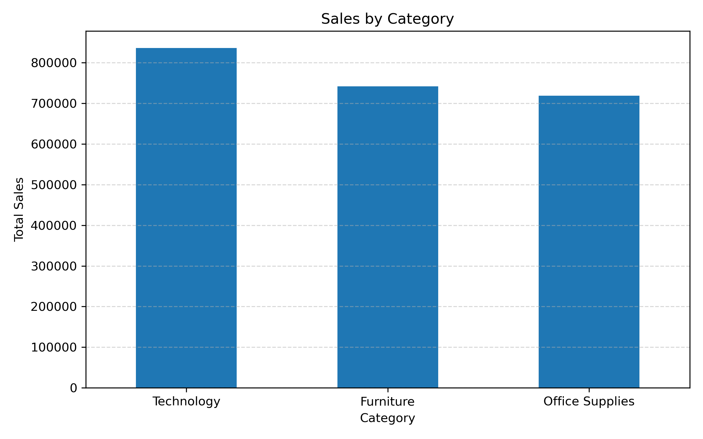
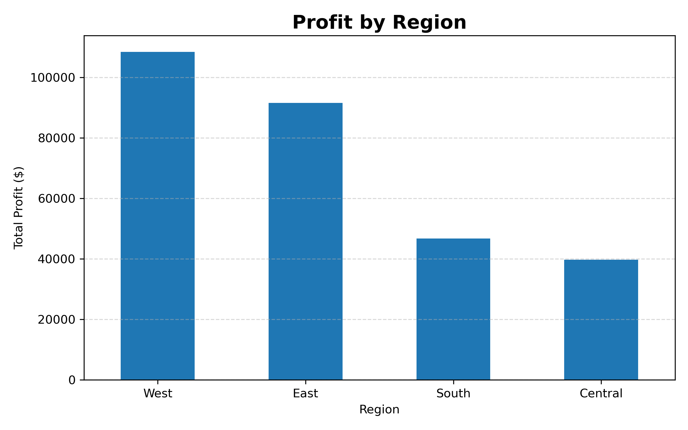
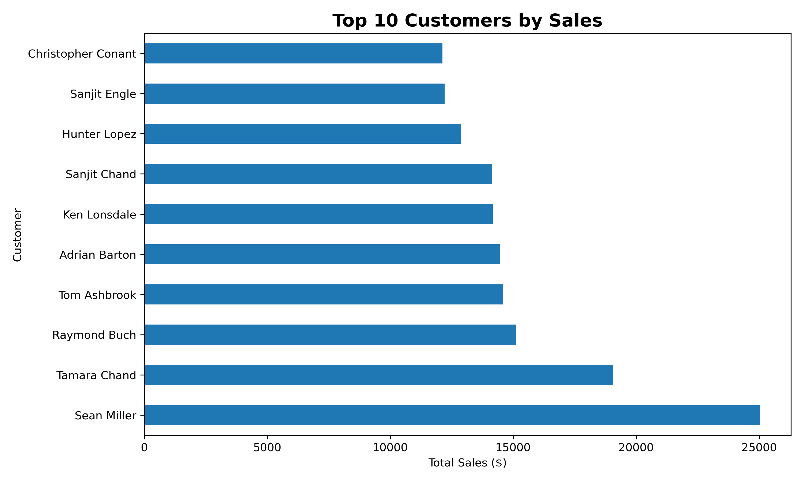
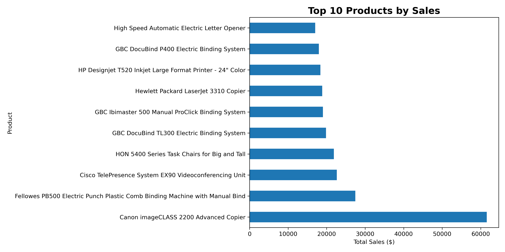

# E Commerce Sales Analytics Dashboard

## Project Overview

This project analyzes the E Commerce Superstore dataset using Excel, MySQL, Python, Power BI, HTML, CSS and JavaScript.

The objective of this project is to analyze sales performance, customer behavior, product performance, regional performance and profit trends using data analysis and visualization techniques.

The project demonstrates an end to end data analytics workflow from data cleaning and SQL analysis to Python visualization, Power BI reporting and an interactive web dashboard.

---

## Live Interactive Dashboard

View the live dashboard

https://prakash-v181.github.io/E-Commerce-Sales-Analytics/

The web dashboard provides interactive analysis of sales and business performance.

Dashboard features include

Total Sales

Total Profit

Total Orders

Total Customers

Profit Margin

Monthly Sales and Profit

Sales by Category

Sales by Region

Customer Segment Analysis

Ship Mode Analysis

Top Products

Top States

Region Filter

Category Filter

Product Search

---

## Power BI Dashboard

The Power BI dashboard provides interactive business analysis of sales, profit, customers, products and regions.

Dashboard KPIs

Total Sales

Total Profit

Total Orders

Total Customers

Profit Margin

Dashboard visualizations include

Sales by Category

Profit by Region

Monthly Sales Trend

Sales by Segment

Top 10 Products

Top 10 Customers

Regional Performance

Product Performance

Power BI file

PowerBI/Ecommerce.pbix

---

## Tools Used

Microsoft Excel

MySQL

Python

Pandas

Matplotlib

Jupyter Notebook

Power BI

HTML

CSS

JavaScript

Chart.js

Visual Studio Code

Git

GitHub

GitHub Pages

---

## Project Structure

```text
E-Commerce-Sales-Analytics/
|
|-- Dataset/
|   |-- Sample - Superstore.csv
|
|-- Excel/
|   |-- Cleaned_Data.xlsx
|
|-- SQL/
|   |-- Database.sql
|   |-- Queries.sql
|
|-- Python/
|   |-- analysis.ipynb
|   |
|   |-- charts/
|       |-- sales_by_category.png
|       |-- profit_by_region.png
|       |-- top10_customers.png
|       |-- top10_products.png
|
|-- PowerBI/
|   |-- Ecommerce.pbix
|
|-- Dashboard Images/
|   |-- dashboard.png
|
|-- index.html
|
|-- LICENSE
|-- README.md
|-- requirements.txt
|-- .gitignore


## Key Insights

- Technology category generated the highest sales.
- West region generated the highest profit.
- Top customers contributed significantly to total sales.
- Product sales varied across different categories.
- Interactive dashboards help identify business performance quickly.

---

## Python Libraries

- pandas
- matplotlib
- openpyxl
- jupyter

---

## Installation

Clone the repository

```bash
git clone https://github.com/prakash-v181/E-Commerce-Sales-Analytics.git
```

Open the project folder

```bash
cd E-Commerce-Sales-Analytics
```

Install dependencies

```bash
pip install -r requirements.txt
```

Run Jupyter Notebook

```bash
jupyter notebook
```

Open

```text
Python/analysis.ipynb
```

---

## Power BI Dashboard

Open

```text
PowerBI/Ecommerce.pbix
```

Refresh the dataset if required.

---

## Dataset

Sample Superstore Dataset

Rows: 9994

Columns: 21

---

## Requirements

See the `requirements.txt` file.

---

## Dashboard Preview


## Python Visualizations

### Sales by Category


### Profit by Region


### Top 10 Customers


### Top 10 Products


Author

Prakash

GitHub
https://github.com/prakash-v181

Project Repository
https://github.com/prakash-v181/E-Commerce-Sales-Analytics

Live Dashboard
https://prakash-v181.github.io/E-Commerce-Sales-Analytics/
